<center><h1>Microscopía Acústica</h1>
<h2 style="color: #1a1a5a">Yassin Achengli</h2></center>

---
<h4 style="color: #818181">Una introducción a las aplicaciones y funcionamiento de la microscopía acústica.</h4>

## ¿Que es la microscopía acústica?

Sobre los años 30 unos científicos buscaban conseguir imágenes en base al fundamento de la reflexión de las ondas acústicas sobre los materiales.
En 1936, El ruso Serguéi Sokolov consiguió las primeras imagenes haciendo uso de ondas acústicas con frecuencias de hasta 3 GHz.

La microscopía acústica es por lo tanto, una técnica que busca obtener informacion topográfica de un material haciendo uso de los fundamentos basados en la reflexión de las ondas acústicas

## ¿Para qué se usa la microscopía acústica?
La microscopía acústica tiene muchas aplicaciones, por ejemplo:

---
* Control de calidad en cadenas de producción para la detección de microdefectos
* Imágenes de microcomponentes electronicos
* Aplicaciones clínicas

En ésta presentación me enfocaré en las aplicaciones relacionadas con el control de calidad
de los componentes electrónicos y la obtención de imágenes topográficas del relieve y capas de los mismos, entre estas aplicaciones la más conocida es la **SAM** *Scanning Acoustic Microscopy* 

# ¿Cómo se hace?

La microscopia se fundamenta en los fenómenos físicos de la refracción de las ondas acústicas en distintos medios sólidos.

Recordemos como se expresa el coeficiente de reflexión y la impedancia característica de un medio.

$$ 
\Gamma = \frac{Z_{02} - Z_{01}}{Z_{02} + Z_{01}}
$$
$$
Z = \rho\cdot c
$$

Siendo el funcionamiento el mismo que el de un sonar, el retardo desde que transmitimos un pulso y lo recibimos marca la distancia al material y por ello mapeando dicho material con distintas frecuencias que poseen distintas profundidades de penetración conseguimos una imagen
muy buena de las capas que conforman el material.

$$
d = c\cdot\frac{\Delta_t}{2}
$$

donde c es la velocidad del sonido en el medio.

<ul>
    <li><span style="color:#6a6a6a; font-style:italic;">Normalmente se usan medios liquidos ya que son más directivos que los medios gaseosos.</li> 
</ul>

## Resolución de las imágenes obtenidas

La frecuencia es un factor clave en la resolución y la profundidad de penetración de nuestras imágenes. 

La resolución depende de la frecuencia y de la geometría de las lentes del transductor 
$W = \frac{c}{f}\cdot\frac{1}{2N.A.}$ o visto en función de la longitud de onda, se toma esta
otra expresión $W = \frac{\lambda}{2N.A.}$.


```python
import numpy as np
import matplotlib.pyplot as plt
from mpl_toolkits.mplot3d import Axes3D
import ipywidgets as widgets
from IPython.display import display

def generar_relieve_chip(tamaño, num_elementos):
    x = np.linspace(0, tamaño, num_elementos)
    y = np.linspace(0, tamaño, num_elementos)
    x, y = np.meshgrid(x, y)
    relieve = np.sin(2 * np.pi * x / tamaño) * np.cos(2 * np.pi * y / tamaño)
    return x, y, relieve

def simular_microscopia_acustica(x, y, relieve, frecuencia, amplitud=1.0):
    onda = amplitud * np.sin(2 * np.pi * frecuencia * np.sqrt(x**2 + y**2))
    datos_simulados = onda * relieve
    return datos_simulados

def graficar_superficie_3d(x, y, z, titulo="Simulación Tomografía 3D", elev=30, azim=45):
    fig = plt.figure()
    ax = fig.add_subplot(111, projection='3d')
    ax.plot_surface(x, y, z, cmap='viridis', edgecolor='k')
    ax.set_xlabel('X')
    ax.set_ylabel('Y')
    ax.set_zlabel('Amplitud')
    ax.set_title(titulo)
    ax.view_init(elev=elev, azim=azim)  # Ajusta la elevación y el azimut
    plt.show()

# Función interactiva
def tomografia_interactiva(tamaño_chip, num_elementos, frecuencia, elevacion, azimut):
    x, y, relieve = generar_relieve_chip(tamaño_chip, num_elementos)
    datos_simulados = simular_microscopia_acustica(x, y, relieve, frecuencia)

    # Visualización interactiva
    graficar_superficie_3d(x, y, datos_simulados, titulo="Simulación Tomografía 3D", elev=elevacion, azim=azimut)

# Widgets interactivos
tamaño_chip_slider = widgets.FloatSlider(value=10.0, min=5.0, max=20.0, step=0.1, description='Tamaño del Chip:')
num_elementos_slider = widgets.IntSlider(value=100, min=50, max=200, step=1, description='Num Elementos:')
frecuencia_slider = widgets.FloatSlider(value=2.0, min=1.0, max=5.0, step=0.1, description='Frecuencia:')
elevacion_slider = widgets.FloatSlider(value=30, min=0, max=90, step=1, description='Elevación:')
azimut_slider = widgets.FloatSlider(value=45, min=0, max=360, step=1, description='Azimut:')

# Interactividad
tomografia_interactiva_interactiva = widgets.interactive(
    tomografia_interactiva,
    tamaño_chip=tamaño_chip_slider,
    num_elementos=num_elementos_slider,
    frecuencia=frecuencia_slider,
    elevacion=elevacion_slider,
    azimut=azimut_slider
)

# Mostrar widgets interactivos
display(tomografia_interactiva_interactiva)


```


    interactive(children=(FloatSlider(value=10.0, description='Tamaño del Chip:', max=20.0, min=5.0), IntSlider(va…


## Ejemplos de uso
En las imágenes siguientes se puede ver algunos resultados reales de capturas tomadas haciendo uso de un microscopio de barrido.
<br><br>

### Escaner de un microchip con vista de altura
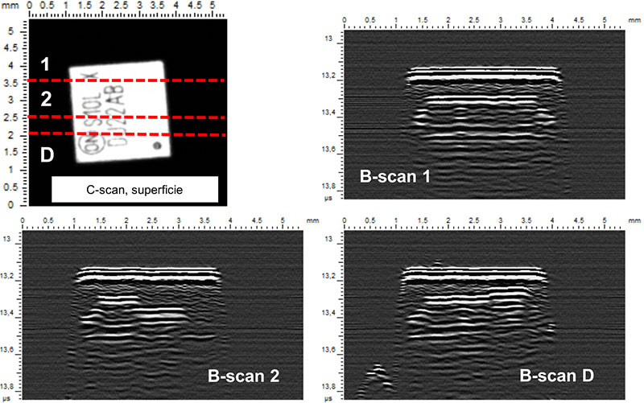

### Escaner de un microchip con vista de perfil
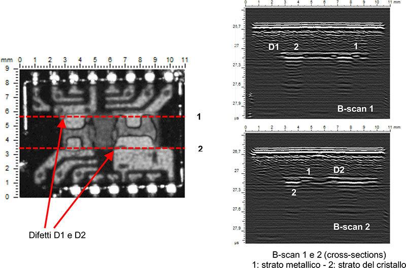

### Bateria defectuosa

Mediante la técnica de barrido se toman capturas longitudinales del cuerpo que se escanea, cómo si se tratase de una impresora recorriendo una hoja.

<ul>
    <li><h3><span style="color:#8c8c8c; font-style: italic;">En la segunda captura se puede ver el defecto, siendo la zona donde se localiza más clara que el resto</span></h3></li>
    <li><h3><span style="color:#8c8c8c; font-style: italic;">En la tercera imagen aparece una batería con acumulación de gases, clara muestra de que es una batería defectuosa y peligrosa.</span></h3></li>
</ul>

## Modos de barrido

### A-SCAN
Escanea un corte transversal del material, útil para conocer a primera vista su estructura
interna.

<div style="display: inline-flex; ">
    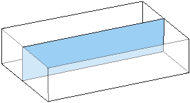
    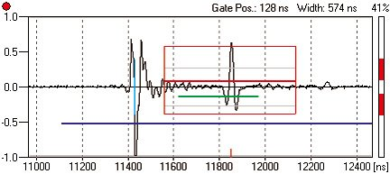
</div>

### B-SCAN
Lo mismo que el A pero siendo un corte longitudinal.

<div style="display: inline-flex; ">
    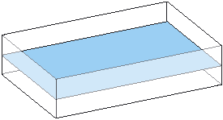
    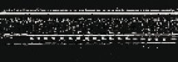
</div>

### C-SCAN
Éste es interesante porque da una imagen precisa del relieve. haciendo varios **B-SCAN**

<div style="display: inline-flex; justify-content: flex-end; align-items: center">
    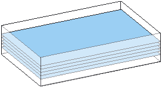
    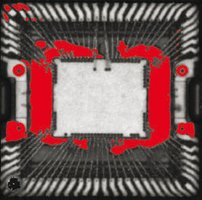
</div>

### Z-SCAN
Varios barridos en capa que permiten obtener información tomográfica y luego ser almacenado
en un fichero de tipo DICOM por ejemplo.

<div style="display: inline-flex; justify-content: flex-end; align-items: center">
    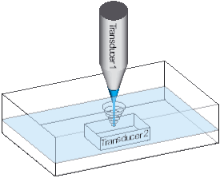
    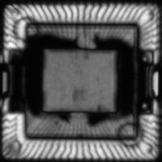
</div>

### X-SCAN
Esta tecnología es muy avanzada, no solo aprovecha los retardos de los pulsos sino que 
detecta las refracciones que llegan de distintas direcciones para así obtener mejor detalle de
su interior.

<div style="display: inline-flex; justify-content: flex-end; align-items: center">
    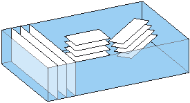
    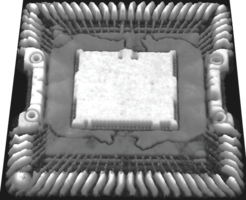
</div>


## Otros usos

La microscopía acústica puede ser una alternativa a los microscopios electrónicos que además de 
ser menos destructivos, también permiten obtener imagenes en movimiento de los microorganismos en
su estado natural.

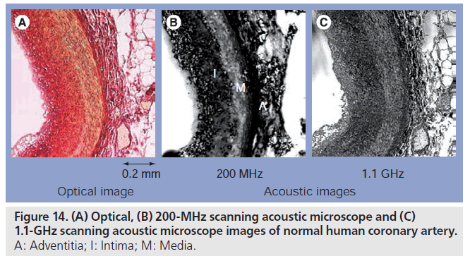

En la primera imagen un téjido bajo un microscopio óptico, en la segunda bajo uno acústico 
funcionando a **200 Mhz** y en la tercera imagen, con una frecuencia de trabajo de **1.1 Ghz**.

**Apreciar que la resolución mejora cuando mas alta es nuestra frecuencia de trabajo.**

## Inconvenientes

El principal inconveniente es que no permite obtener imagenes en color además de su alto precio de
venta; los **SAM** son aparatos que cuestan millones de pesetas.

- Ver precio en: 
[directindustry.es SAM](https://www.directindustry.es/prod/pva-tepla-analytical-systems-gmbh/product-178684-1916915.html) *

- *Cuando no aparece el precio es porque es verdaderamente caro...*

## Fuentes de información

- [Blog abcs: Aplicaciones de la microscopía acústica al estudio de los componentes electrónicos](https://www.abcs.it/it/blog/microscopia/microscopia-acustica-a-scansione-sam-a-pplicata-allo-studio-di-componenti-elettronici)

- [Revista Science direct: Scanning acoustic microscopy as non-destructive ...](https://www.sciencedirect.com/science/article/pii/S2666248520300354?ref=pdf_download&fr=RR-2&rr=8336b68b7aa703a8)
  
- [Microscopía acústica para la detección de micro-defectos](https://www.pvatepla-sam.com/en/)

- [Aplicaciones biomédicas de la microscopía acústica](https://www.openaccessjournals.com/articles/acoustic-microscopy-latest-developments-and-applications-8192.html)
